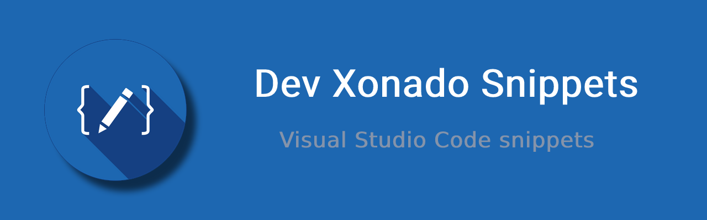
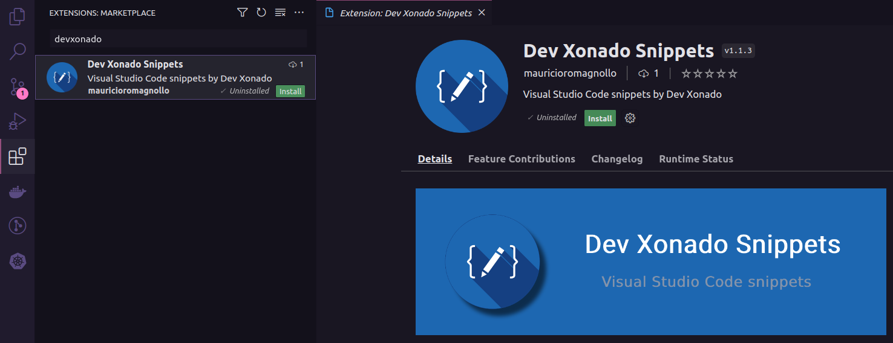

![BADGE_VSCODE] ![BADGE_VERSION] ![BADGE_LAST_UPDATED] ![BADGE_INSTALLS] ![BADGE_LICENSE]

> My Visual Studio Code snippets.

<div align='center'>

🌎 [Extension](https://marketplace.visualstudio.com/items?itemName=x0n4d0.vscode-snippets) | 🏡 [Github Repository](https://github.com/x0n4d0/vscode-snippets)

</div>

<br>

## **⚙️ Installation**

To install the extension, you can use this command:

```bash
ext install x0n4d0.vscode-snippets
```

Or, search for `Xonado Snippets` in the Visual Studio Code `Extensions` menu.



<br>

## **🔤 Supported Languages**

- JavaScript (.js)
- TypeScript (.ts)
- TypeScript React (.tsx)
- Shell Script Bash (.sh)

<br>

## **🧪 Testing**

- Press <kbd>`F5`</kbd> to open a new window with your extension loaded;
- Create a new file with a file name suffix matching your language;
- Verify that your snippets are proposed on IntelliSense;
- You can relaunch the extension from the debug toolbar after making changes to the files listed above;
- You can also reload (<kbd>`Ctrl+R`</kbd> or <kbd>`Cmd+R`</kbd> on Mac) the VS Code window with your extension to load your changes.

OR,

You can run `npm test` to generate package and install into your VSCode.

<br>

## **📝 Snippets**

Below is the list of all avaible Snippets. The **→** means: press <kbd>`TAB`</kbd> key.


|                    Trigger | Content                                                                      |
| -------------------------: | ----------------------------------------------------------------------------- |
|                    `rfc →` | Create a functional component in React                                             |
|           `styled →` | Create a stylization file with Styled Components                      |
|           `bash →` | Initializes a bash file with import and execute permission                      |
|           `impf →` | Write `import { } from '';`                      |
|           `exclass →` | Create one class with export and constructor                      |
|           `tests →` | Create one test suite                      |
|           `testc →` | Create one test case                      |

<br>

## **🌱 Contributing**

1. Fork this repository
2. Create one Branch `git checkout -b feature/my-feature`
3. Add you changes `git add .`
4. Commit your changes `git commit -m "feat: add my new feature example"`
5. Push your Branch `git push origin feature/my-feature`
6. Open one Pull Request

> Thanks to contribute! 🤝

<br>

## **📚 References**

- [Visual Studio Docs: User Defined Snippets](https://code.visualstudio.com/docs/editor/userdefinedsnippets)
- [Visual Studio Api: Publishing Extensions](https://code.visualstudio.com/api/working-with-extensions/publishing-extension)

<br>

## **📜 License**

[MIT](./LICENSE) &#169; Maurício Romagnoli.

<!-- BADGES -->

[BADGE_VSCODE]: https://img.shields.io/badge/Visual%20Studio%20Code-Snippets-blue
[BADGE_VERSION]: https://img.shields.io/visual-studio-marketplace/v/x0n4d0.vscode-snippets
[BADGE_LICENSE]: https://img.shields.io/github/license/x0n4d0/vscode-snippets
[BADGE_STARS]: https://img.shields.io/visual-studio-marketplace/stars/x0n4d0.vscode-snippets
[BADGE_LAST_UPDATED]: https://img.shields.io/visual-studio-marketplace/last-updated/x0n4d0.vscode-snippets
[BADGE_INSTALLS]: https://img.shields.io/visual-studio-marketplace/i/x0n4d0.vscode-snippets
[BADGE_RELEASE_DATE]: https://img.shields.io/visual-studio-marketplace/release-date/x0n4d0.vscode-snippets